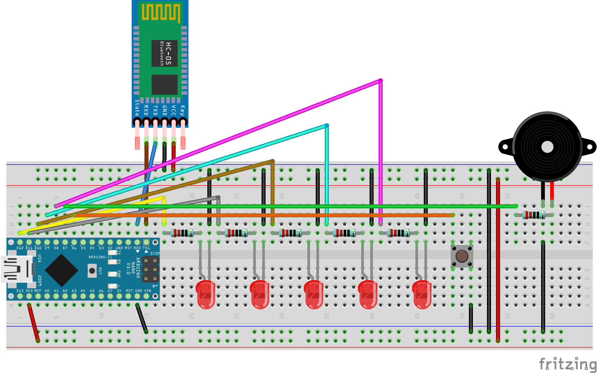

# Lullaby
Open source smart music box based on Arduino. It can store a melody inside the EEPROM which can later be played by pressing a button or by sending commands to the serial port. 

## Features
 - programmable, with persistent melody storage
 - supports 4 types of notes (whole, half, quarter, eighth) with relative rests, across 7 octaves. Notes can also be altered and dotted
 - customizable BPM
 - supports any time signature having a denominator of 2, 4 or 8 (e.g. 4/4, 2/2, 6/8...)
 - dedicated [mobile app](https://github.com/aurasphere/lullaby-mobile)
 - real-time playing (can be used as a piano or while composing the melody to store)
 - melody export (useful to save multiple melodies and restore them anytime)
 - optional led randomization on each note played

## Components
 - HC-05 Bluetooth Module
 - Active Buzzer
 - Arduino Nano (or any other compatible board)
 - Button
 - Resistance (1 needed, up to 5 more optional)
 - Leds (optional, up to 5) 
 
## Schematics



## Commands

Communication is performed through serial port. Each command starts with an ASCII lowercase character and ends with a newline (```\n```). Some commands also require a melody argument (the encoding is described in the next paragraph). The available commands are the following:

 - **p**, plays the melody currently stored in EEPROM
 - **s(melody)**, saves the given melody into EEPROM
 - **d**, prints the details of the melody stored
 - **e**, exports the given melody in the Lullaby protocol
 - **n(melody)**, plays the given melody
 
## Melody Protocol

Lullaby uses a custom protocol based on hexadecimal bit stuffing. Each melody is represented by appending an header to a sequence of notes:

    <header><note><note><note>...
	
Both the header and the notes have a fixed length of 3 characters, so the length of each encoded melody is guaranteed to be a multiple of 3. The length of any melody is equal to 

    (encodedLength - 3) / 3.

### Header

The melody header contains the BPM and beat unit (e.g. the denominator of the time signature). The BPM is converted to 2 hexadecimal characters (using padding if needed) and then prepended to the beat unit, which is a digit between 1-3:
	  
|     Time Signature     | Beat Unit |
|:----------------------:|:---------:|
| */2 (2/2, 3/2, 4/2...) |     1     |
| */4 (2/4, 4/4, 5/4...) |     2     |
| */8 (3/8, 6/8, 9/8...) |     3     |
	    
For example, given a melody with a time signature of 4/4 and 120 BPM, the resulting header will be ```782```.
	    
### Notes

Each note is represented by 3 hexadecimal characters (1 + 1/2 bytes) containing the following informations (in order):
 - **pitch**, an integer ranging from 0 to 7 (3 bits) with 1 being C (Do) and 7 being B (Si). 0 is a rest
 - **duration**, an integer ranging from 0 to 4, (2 bits) indicating the note duration, according to the table below
 - **octave**, an integer ranging from 1 to 7 (3 bits)
 - **extended**, 0 (false) or 1 (true) (1 bit). Whether the note is dotted or not
 - **altered**, 0 (false) or 1 (true) (1 bit). Whether the note is altered (#) 

|          Note          |  Duration |
|:----------------------:|:---------:|
| Whole   𝅝	          |     0     |
| Half 	  𝅗𝅥 	          |     1     |
| Quarter ♩              |     2     |
| Eight   ♪              |     3     |

The pitch, duration and octave are stored into the first byte (2 hex chars) meanwhile the extended and altered flags are stored in the last half byte (1 hex char). All the stuffing is big endian.

For example, we can calculate the value of the note G#5𝅗𝅥 as following:

    (5 << 5) + (1 << 3) + 5 =  173 = 0xAD // pitch + duration + octave, all compressed in 1 byte
    (0 << 3) + (1 << 2) = 4 = 0x4 // extended + altered, all compressed in 1/2 byte
    
And the final result is ```AD4```. So, taking the header we can attach the header we build before to have a complete melody, made up of only one note: ```782AD4```. 

To avoid unexpected behavior, Lullaby allows melodies up to 64 notes by default, but this can be easily configured by changing the ```MAX_MELODY_LENGTH``` property according to your device memory (both EEPROM and SRAM). 
